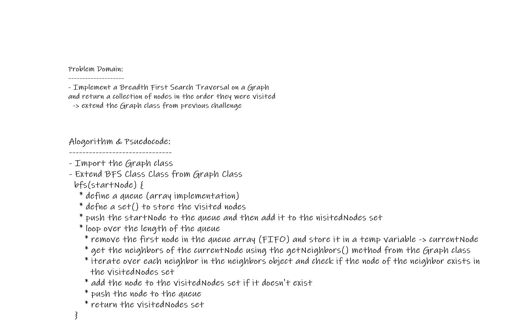

# Breadth-First Traversal of a Graph

## Background Summary

**Traversing a _graph_ is similar to traversing a _tree_**  

> **REM: trees are a special case of graphs - graphs with no cycles**  

### Traversary Approaches:

- **Breadth First Approach**  
  implemented with a `queue`
- **Depth First Approach**  
  implemented with a `stack`

### Breadth First Traversal

**Breadth first traversal is when you visit all the nodes that are closest to the root as possible. From there you traverse outwards, level by level, until you have visited all the vertices/nodes**

- **the main difference between trees breadth-first and graphs breadth-first, is that graphs can have cycles, this leaves the possibility to be in an infinite loop when we're trying to traverse a cyclic graph**
- **to prevent, an infinite loop from occuring, we need to have some sort of flag that specifies if we have already visited that vertices**

## Challenge

**Extend your graph class with a breadth-first traversal method that accepts a starting node, and returns a collection of nodes in the order they were visited**

## Approach & Efficiency

**Approach:**
- Exporting and importing the `Graph` class and extending the class

**Big O:**
- **Space Complexity:**  
  O(V); V: number of vertices  
  => the memory usage of bfs is linearly dependant upon the number of vertices/nodes in a graph - storing in the queue

- **Time Complexity:**
   O(V + E); V: number of vertices, E: number of edges  
   => the runtime of a bfs for a graph with an adjacency list is dependent upon the sum of the number of nodes and the number of edges

## Solution

**Visual Exaple:**  

## Requirements

- **`graph` class module - graph implementation**
- **`queue` -  array implementation or a class module**
