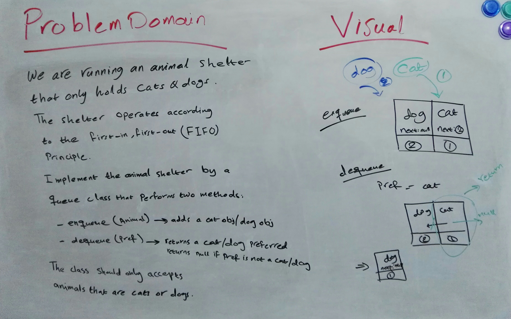

# Queues - FIFO Principle Implementation

## Background Summary
- Queues are abstract data types and linear data structures.  
- Queues are sequential collections of nodes.  
- Unlike Stacks, queues are open at both ends.  
- Queues work based on the first-in, first-out (FIFO) principle, where nodes are inserted at the end of the queue and removed from the front of the queue.  
- Queues have two main operations:
  - `enqueue`: insertion operation that inserts a node at the end of the queue.
  - `dequeue`: removal operation that removes the node at the front (begining) of the queue. 
- Queues can be implemented using arrays or linked lists.
- Applications of queues:
  - used whenever we need to manage objects in order starting with the first one in
  - i.e. : printing documents on a printer, call center systems answering people on hold people, and so on.

Read more about queues implementation in JS:
- [Implementation of Queue in Javascript](https://www.geeksforgeeks.org/implementation-queue-javascript/)
- [JavaScript Queue](https://www.javascripttutorial.net/javascript-queue/)
- [The Little Guide of Queue in JavaScript](https://hackernoon.com/the-little-guide-of-queue-in-javascript-4f67e79260d9)
- [Stacks and Queues Guide](https://codefellows.github.io/common_curriculum/data_structures_and_algorithms/Code_401/class-10/resources/stacks_and_queues.html)

## Challenge Description 
**JS Queue FIFO Approach Implementation**  
Create a class called AnimalShelter that implements a queue following the FIFO approach, with two methods:
- `enqueue`: adds animals that are only cats or dogs to the queue.
- `dequeue`: removes a preferred animal (cat/dog) from the front of the queue. 

## Approach & Efficiency
**Approach**  
- used array implementation for the queue
- used conditional statements (switch and if)

**Efficiency: Big O Notation**  
- Time Complexity:
  - O(1) --> for both methods
- Space Complexity:
  - O(n) --> for both methods

  ## WhiteBoard

