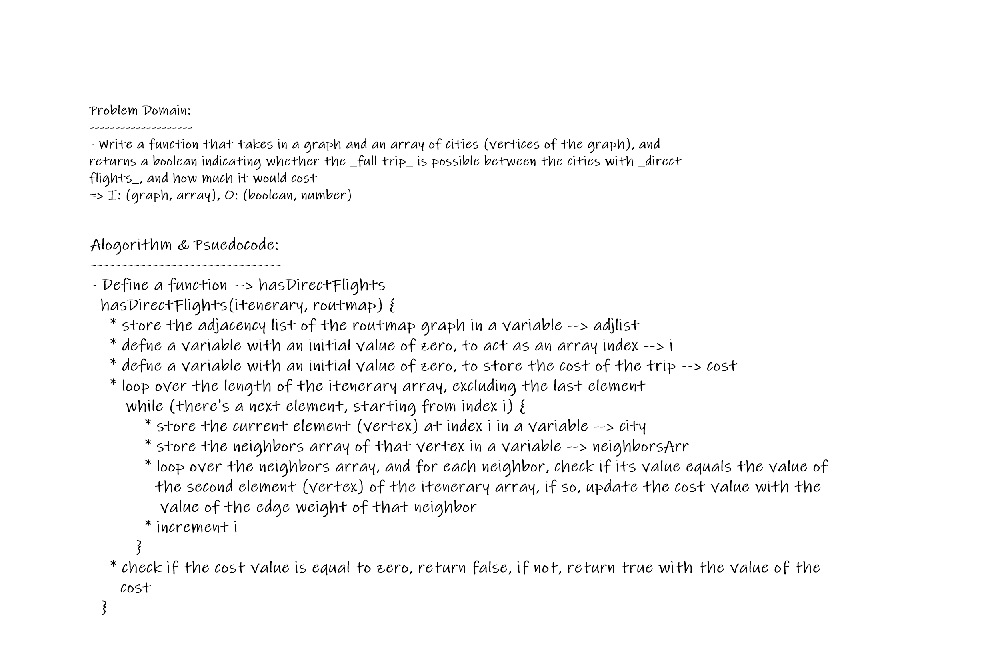

# Graphs - Find Edges

Given a business trip itinerary, and an Alaska Airlines route map, is the trip possible with direct flights? If so, how much will the total trip cost be?

## Challenge Description

**Write a function that takes in a graph and an array of cities (vertices of the graph), and returns a boolean indicating whether the _full trip_ is possible between the cities with _direct flights_, and how much it would cost**

## Approach & Efficiency

**Approach:**
- loops (`while`, `forEach`) and conditional statements

**Big O:**
- **Space Complexity:**  
   O(V + E); V: number of vertices, E: number of edges  
   => the memory usage is dependent upon the sum of the number of nodes and the number of edges because the adjacency list of the graph is reserved in memory (stored in a variable) + the addition of two constant numbers (`i`: O(1) + `cost`: O(1) = 2O(1))   
   ==> O(V+E) + 2O(1) = O(V+E)

- **Time Complexity:**
   O(n * m); n: number of elements in input array (`itenerary`), m: number of elements in the array of edges (`neighborsArr`)  
   => the runtime dependends on both n and m   
   ==> (`for loop`: O(m) + `while loop`: O(n) = O(n*m))

## Requirements

- **`graph` class module - graph implementation**

## Solution

  

**Visual Example:**  

**Output Example:**  
