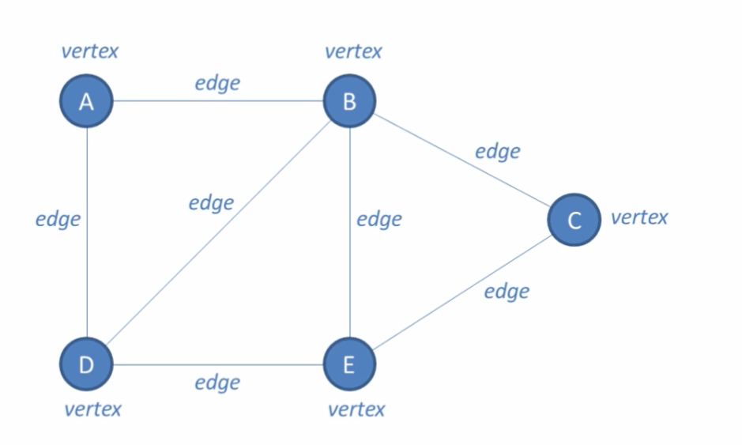
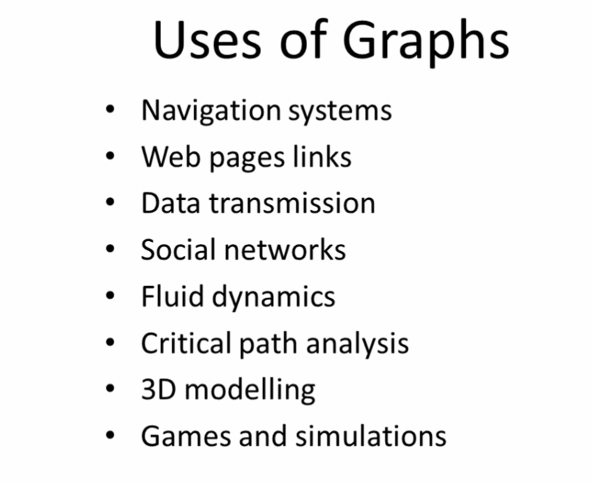
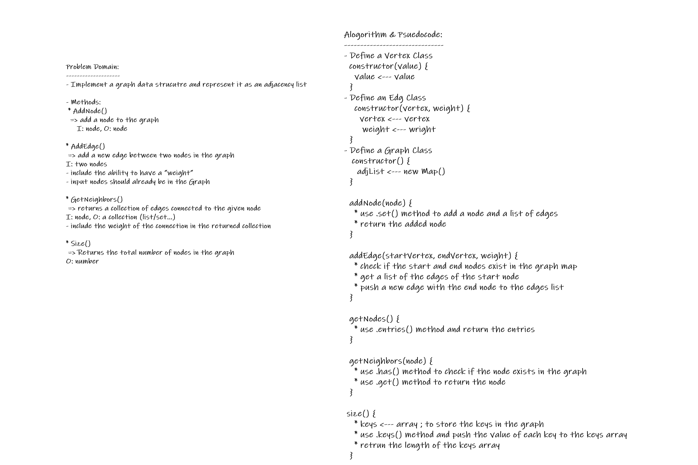

# Graphs

## Background Summary

**Graphs are a type of DS that is a non-linear, collection of nodes (called vertices) that are connected by line segments (called edges)**

- _NOTE_: Trees are a type of graphs

### Graphs Visualization:

### Types of Graphs (according to directions):

- **Undirected Graphs**
- **Directed Graphs (Digraph)**

## Challenge Description

**Implement a graph ds, represented as an adjacency list.**

## Approach & Efficiency

**Approach:**
- using ES6 classes, definning a class for vertices, a class for edges, and a class for the graph which uses JS `Map()`

**Big O:**
- **Space Complexity:**  
  O(V + E); V: number of vertices, E: number of edges  
  => the memory usage of an adjacency list is directly proportional to the sum of the number of nodes and the number of edges

- **Time Complexity:**
   O(V + E); V: number of vertices, E: number of edges  
   => the runtime is dependent upon the sum of the number of nodes and the number of edges

## API

- **`addNode()`**
   * Adds a new node to the graph
   * Takes in the value of that node
   * Returns the added node

- **`addEdge()`**
   * Adds a new edge between two nodes in the graph
   * Include the ability to have a “weight”
   * Takes in the two nodes to be connected by the edge
       * Both nodes should already be in the Graph

- **`getNodes()`**
   * Returns all of the nodes in the graph as a collection

- **`getNeighbors()`**
   * Returns a collection of edges connected to the given node
   * Takes in a given node
   * Include the weight of the connection in the returned collection

- **`size()`**
   * Returns the total number of nodes in the graph

## Whiteboard

