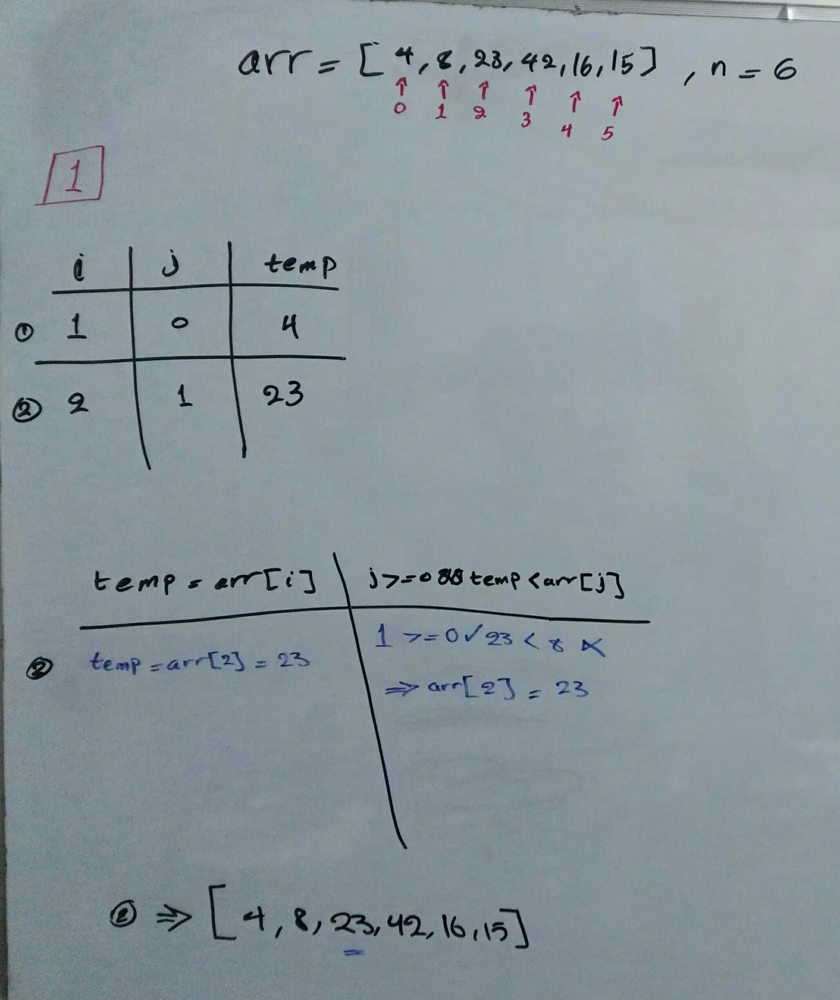
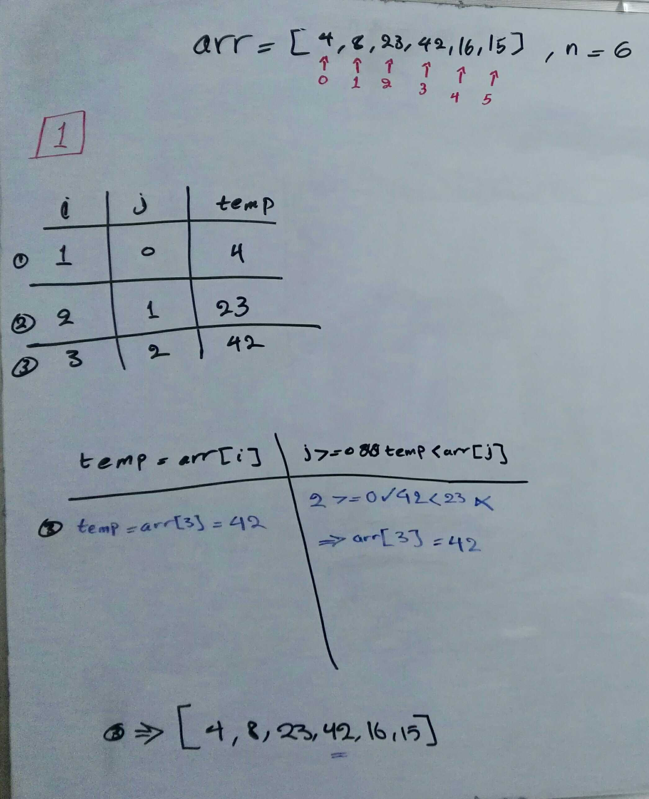
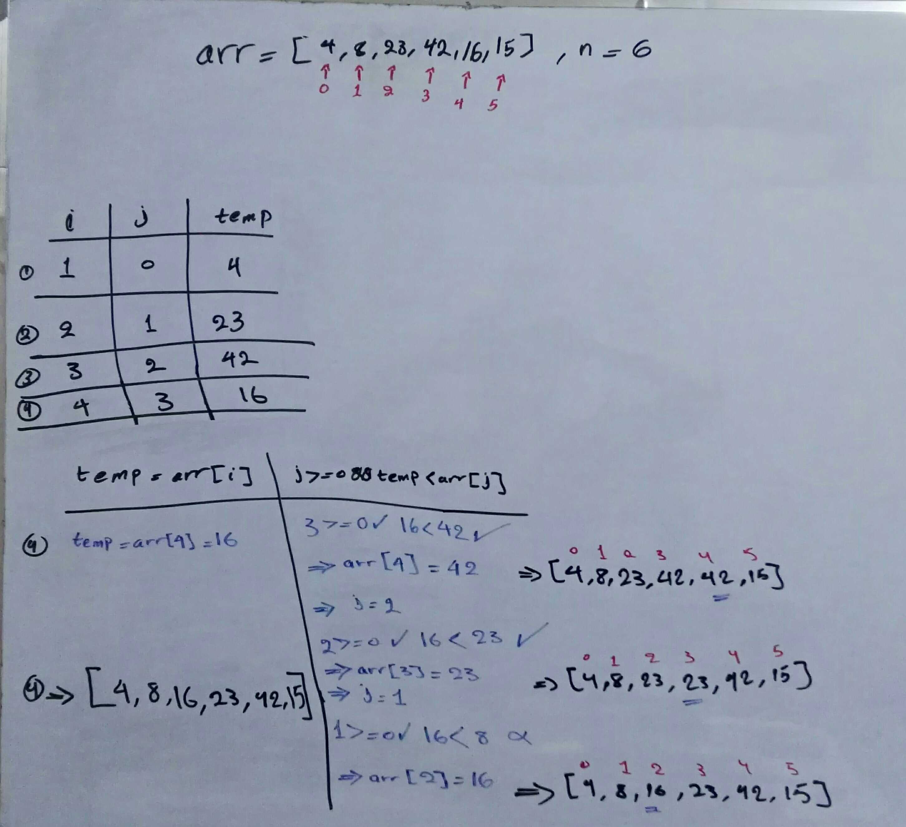
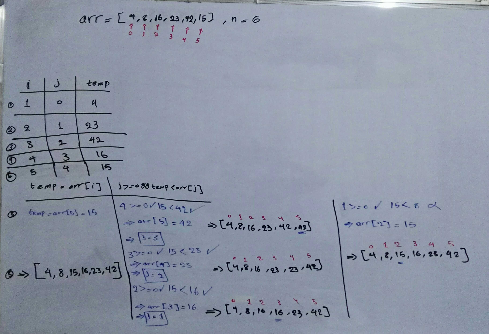

# Insertion Sort
## Bushra Bilal

### Intro:

Insertion Sort is a sorting algorithm that sorts arrays one element at a time.  
The Insertion Sort algorithm is only effecient on arrays of small sizes.  

We'll be tracing the Insertion Sort algorithm using the following psuedocode:
```js
InsertionSort(int[] arr)
  
    FOR i = 1 to arr.length
    
      int j <-- i - 1
      int temp <-- arr[i]
      
      WHILE j >= 0 AND temp < arr[j]
        arr[j + 1] <-- arr[j]
        j <-- j - 1
        
      arr[j + 1] <-- temp
```

and using this array as input:  
`[8,4,23,42,16,15]`

### Procedure:

- we'll keep track of changes in each iteration by following the psuedocode line by line, excuting and reflecting the changes on the array.
- we'll trace the values in tables.
- in each iteration, we compare an element with its previous.

we start with the second element of the array, and evaluate wether or not it is less than the previous element (first element), we find that the second element is less than the first element, so we change the value of the second element to the value of the first element, then we update the value of the first element to the smallest value between the two, which is the value of the second element, we update the values and continue for all elements of the array.

#### Iteration 1:

- `i = 1`
- `j = i -1 = 0`
- `temp = 4`
- `arr = [4, 8, 23, 42, 16, 15]`  


#### Iteration 2:

- `i = 2`
- `j = i -1 = 1`
- `temp = 23`
- `arr = [4, 8, 23, 42, 16, 15]`  


#### Iteration 3:

- `i = 3`
- `j = i -1 = 2`
- `temp = 42`
- `arr = [4, 8, 23, 42, 16, 15]`  


#### Iteration 4:

- `i = 4`
- `j = i -1 = 3`
- `temp = 16`
- `arr = [4, 8, 16, 23, 42, 15]`  


#### Iteration 5:

- `i = 5`
- `j = i -1 = 4`
- `temp = 15`
- `arr = [4, 8, 15, 16, 23, 42]`  
