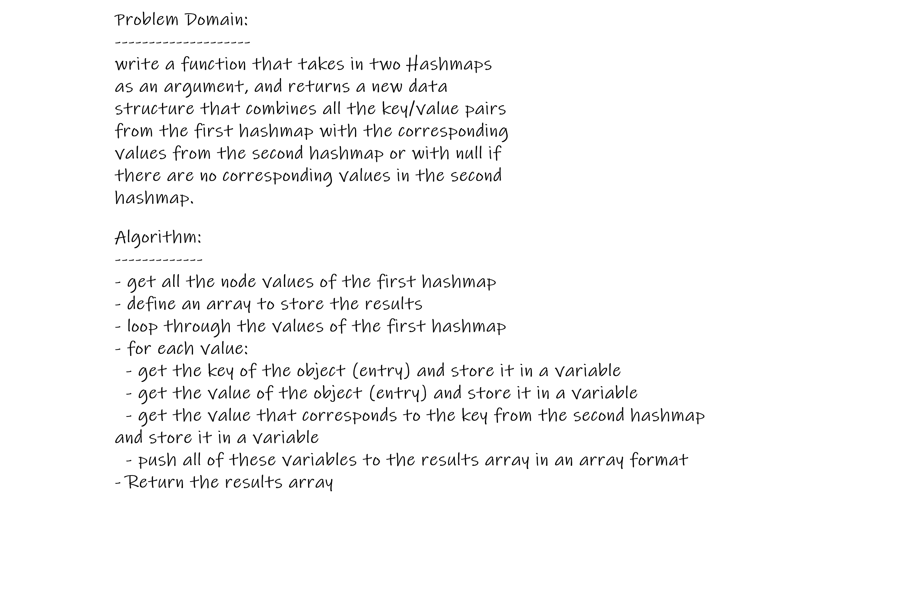
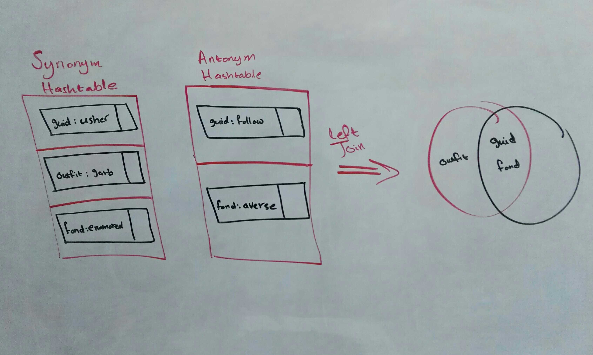

# Hashmaps Left Join

## Background Summary

### SQL Joins
- **The `Join` statement in SQL is used to combine rows from two or more tables based on a common field between them**
- **There are different types of `Join` statements in SQL that combine rows in different ways**

### Left Join
- **SQL `LEFT JOIN` statement returns all the rows of the table on the left side of the join, and matching rows for the table on the right side of join**

- **Left Join logic:**
  - **all the rows of the left table are returned**
  - **only matching rows from the right table are returned**
  - **`Null` is returned from the right table for the left table rows that have no matching row in the right table**

- **Left Join Logic Summary:**   
    **a left join returns all the values from the left table, plus matched values from the right table or NULL in case of no matching join predicate**

**Visual representation of Left Join, where `A` is the left table, and `B` is the right table:**  

## Challenge Description

**Implement a simplified LEFT JOIN for 2 Hashmaps**

- **apply the Left Join logic on two Hashmaps, instead of two SQL tables** 

## Feature Tasks

- Write a function that LEFT JOINs two hashmaps into a single data structure

- The first parameter is a hashmap that has word strings as keys, and a synonym of the key as values

- The second parameter is a hashmap that has word strings as keys, and antonyms of the key as values

- Combine the key and corresponding values (if they exist) into a new data structure according to LEFT JOIN logic

- All the values in the first hashmap are returned, and if values exist in the “right” hashmap, they are appended to the result row. If no values exist in the right hashmap, then some flavor of NULL should be appended to the result row

- I/O Example:
 

## Approach & Efficiency
- used the Hashmap class from previous challenge
- consditional statement and a loop

### Big O
- Space Complexity:  
  O(n); where n is the number of elements in the results array

- Time Complexity:  
  O(n); where n is the number of elements in data array

## Whiteboard

