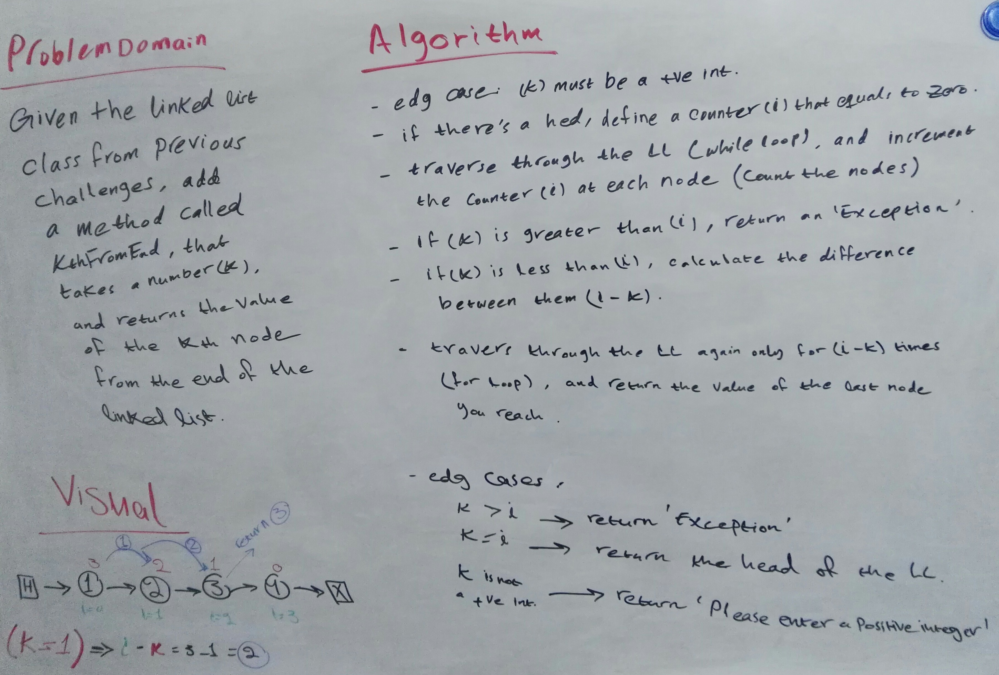
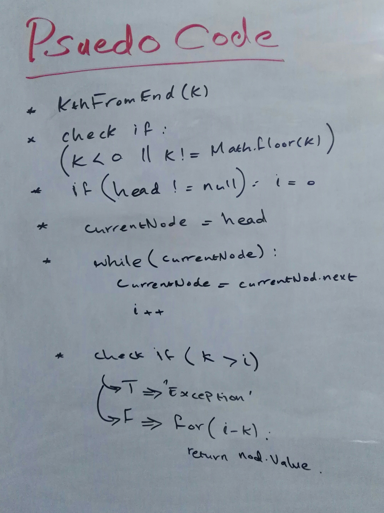
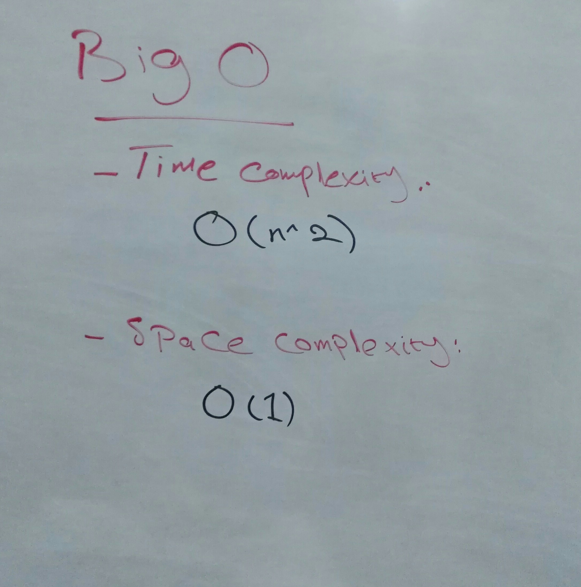

# Singly Linked Lists 

## Background Summary
- Linked Lists are a dynamic type of data structures.  
- A Linked List is an ordered chain of nodes that are linked together by reference.  
- Unlike Arrays, Linked Lists use a referencing system and do not store data in a fixed memory locations, the memory size can be dynamically modified during runtime.  
- A Linked List has a pointer property, the _header_, which points to the first node in the list.  
If  the LL is empty, the header points to Null.
- A Singly Linked List is a linear, uni-directional type of LLs in which data are stored in node elements that contain two properties, one to store the data, and a _next_ pointer that points (references) to the next node in the list.  
The last node in the list points to Null. 
- In a Singly LL nodes can be accessed only through the head and the next pointers by traversing the list in one direction, starting from the node at head.

## Challenge Description 
**JS Singly Linked List Implementation - Finding the kth Node From End**  
Add a method to the previous LL calss:
- a `kthFromEnd()` method that given a number k, returns the value of the kth node from the end of the LL

## Approach & Efficiency
**Approach**  
- using conditional statements and loops (while an for)
- dealing with the LL implementation directly using the LL class without using the array implementation
- visualizing the LL with an example to help impleminting the features and methods  

**Efficiency: Big O Notation**  
- Time Complexity (kth from end method):
  - O(n^2)
- Space Complexity:
  - O(1)

## WhiteBoard / CI
- [Github Actions](https://github.com/bushra-401-advanced-javascript/data-structures-and-algorithms/actions?query=is%3Asuccess)  

