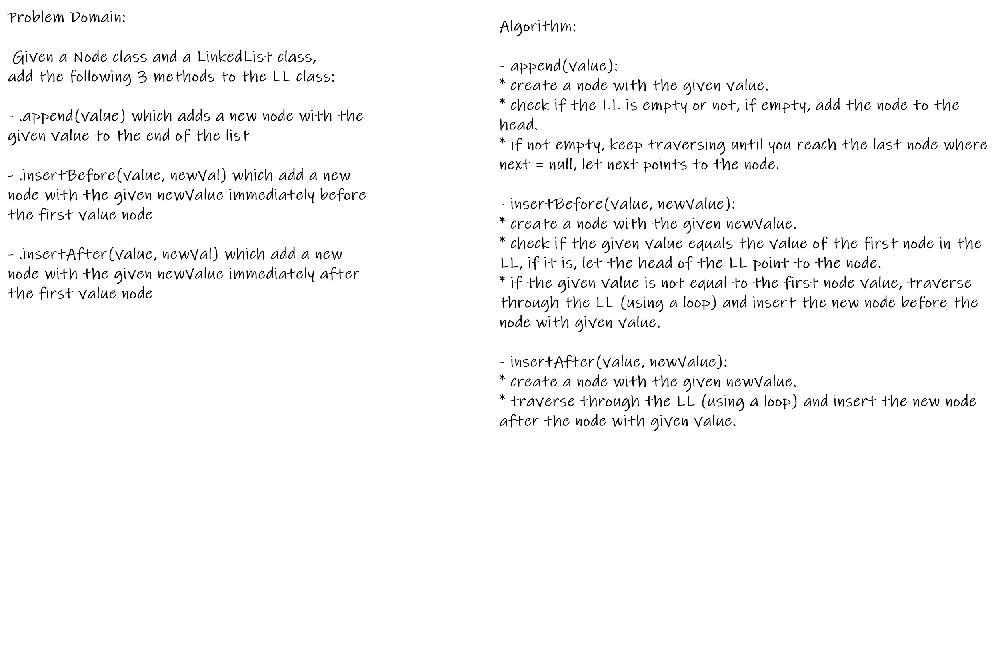
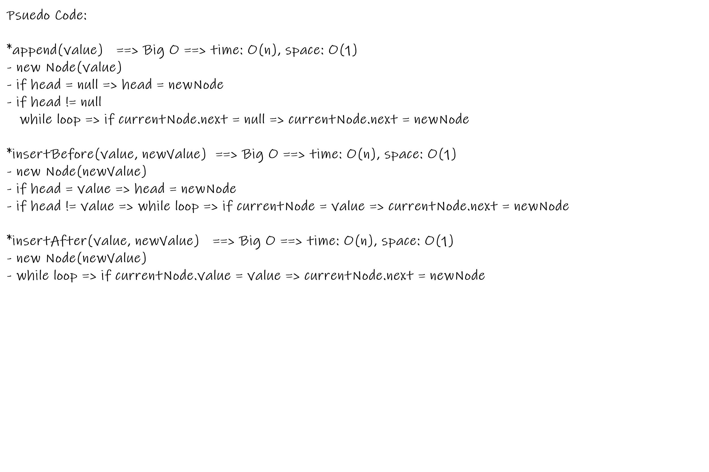

# Singly Linked Lists 

## Background Summary
- Linked Lists are a dynamic type of data structures.  
- A Linked List is an ordered chain of nodes that are linked together by reference.  
- Unlike Arrays, Linked Lists use a referencing system and do not store data in a fixed memory locations, the memory size can be dynamically modified during runtime.  
- A Linked List has a pointer property, the _header_, which points to the first node in the list.  
If  the LL is empty, the header points to Null.
- A Singly Linked List is a linear, uni-directional type of LLs in which data are stored in node elements that contain two properties, one to store the data, and a _next_ pointer that points (references) to the next node in the list.  
The last node in the list points to Null. 
- In a Singly LL nodes can be accessed only through the head and the next pointers by traversing the list in one direction, starting from the node at head.

## Challenge Description 
**JS Singly Linked List Insertions**  
Complete on the Singly LL implemented in the previous challenge, and add these 3 methods:
- append(value) --> to add a Node at the end of the LL
- insertBefore(value, newVal) --> to add a Node before a specific Node
- insertAfter(value, newVal) --> to add a Node after a specific Node  

## Approach & Efficiency
**Approach**  
- defining the classes for the Node and the Linked List
- impleminting the methods using conditional if statements and while loops
- visualizing the LL with an example to help impleminting the features and methods  
i.e. :
```javascript 
//append(value)
LL: [H] -> (1) -> Null;
append(2): [H] -> (1) -> (2) -> Null;

//insertBefore(value, newValue)
LL: [H] --> (1) --> (2) --> (4) --> [x];
insertBefore(4, 3): [H] --> (1) --> (2) --> (3) --> (4) --> [x]; 

//insertAfter(value, newValue)
LL: [H] --> (1) --> (2) --> (3) --> [x];
insertAfter(3, 4): [H] --> (1) --> (2) --> (3) --> (4) --> [x];

```
**Efficiency: Big O Notation**  
- Time Complexity:
  - O(n) --> for all methods
- Space Complexity:
  - O(1) for all methods

## WhiteBoard / CI
- [Github Actions](https://github.com/bushra-401-advanced-javascript/data-structures-and-algorithms/actions?query=is%3Asuccess)  







