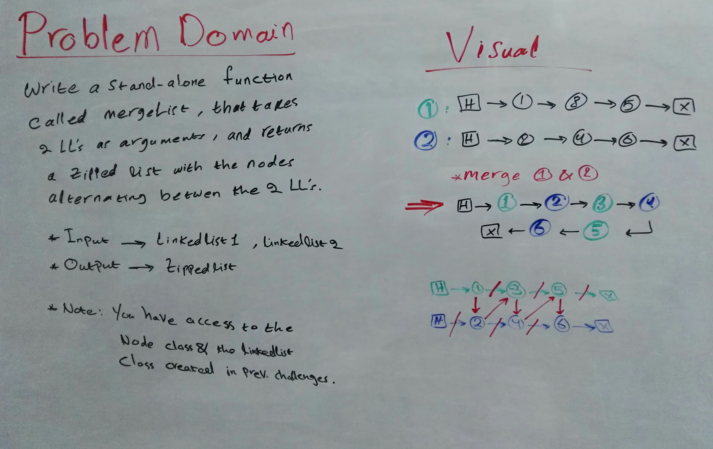
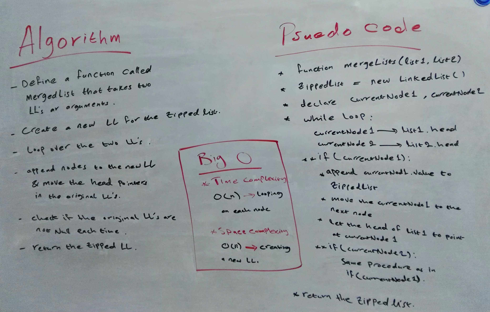

# Singly Linked Lists - Merge Two LL's In An Alternating Manner

## Background Summary
- Linked Lists are a dynamic type of data structures.  
- A Linked List is an ordered chain of nodes that are linked together by reference.  
- Unlike Arrays, Linked Lists use a referencing system and do not store data in a fixed memory locations, the memory size can be dynamically modified during runtime.  
- A Linked List has a pointer property, the _header_, which points to the first node in the list.  
If  the LL is empty, the header points to Null.
- A Singly Linked List is a linear, uni-directional type of LLs in which data are stored in node elements that contain two properties, one to store the data, and a _next_ pointer that points (references) to the next node in the list.  
The last node in the list points to Null. 
- In a Singly LL nodes can be accessed only through the head and the next pointers by traversing the list in one direction, starting from the node at head.

## Challenge Description 
**JS Singly Linked Lists Merging**  
Create a stand-alone function that uses the Node class and LinkedList class from previous challenges:
- accepts 2 LL's and merges them into a new zipped LL with alternating nodes. 

## Approach & Efficiency
**Approach**  
- importing the classes for the Node and the Linked List
- creating a new function that uses conditiona statements and a while loop to merge the two given lists
- visualizing the zipped LL with an example to help impleminting the features and methods 

**Efficiency: Big O Notation**  
- Time Complexity:
  - O(n) --> using a while loop
- Space Complexity:
  - O(n) --> creating a new LL

  ## WhiteBoard

