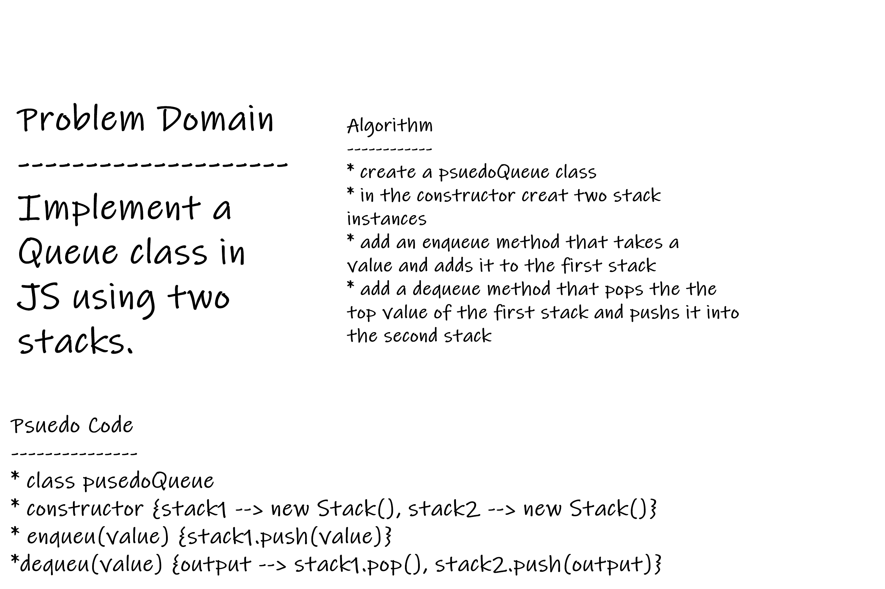
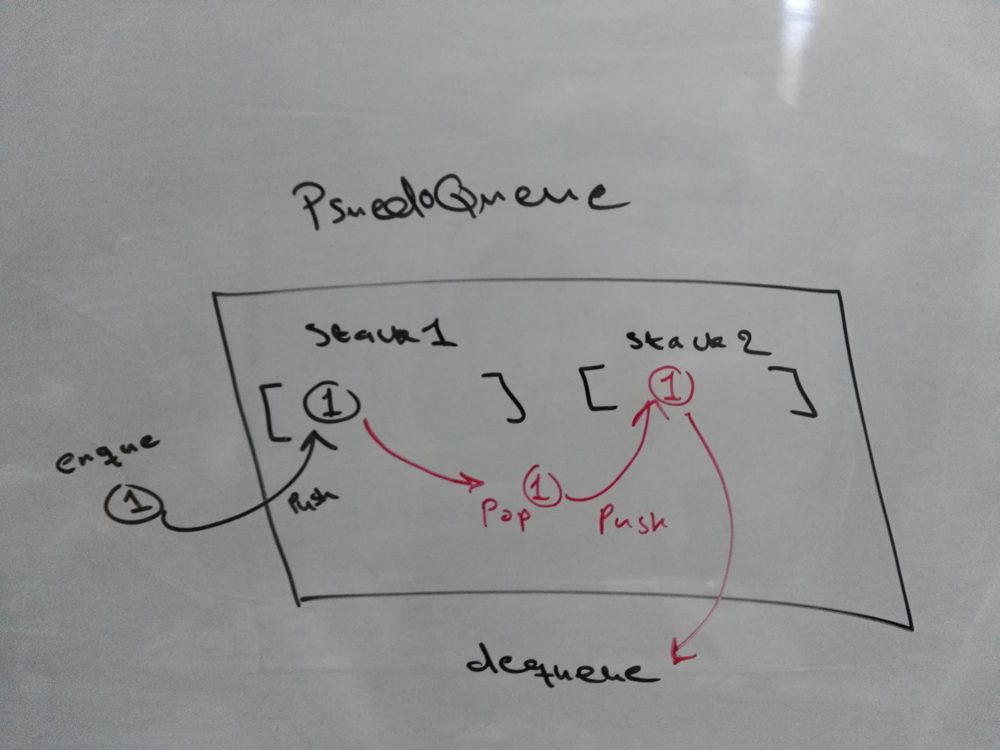

# Stacks and Queues

# Challenge
Implement the queue functionality (enqueue and dequeue) using two stacks with (pop, push, and peek) methods.

# Approach & Efficiency
### Approach:

using classes, loops, and conditional statements

### Efficiency (Big O Notaion):

- Space complexity:
  - `enqueue` method => O(n) depends on the number of elements pushed into the array (stack implementation)
  - `dequeue` method => O(1) a constant operation
- Time complexity:
   - `enqueue` method => O(n) O(n) depends on the number of elements pushed into the array (stack implementation)
   - `dequeue` method => O(1) O(1) a constant operation

# Whiteboard:

