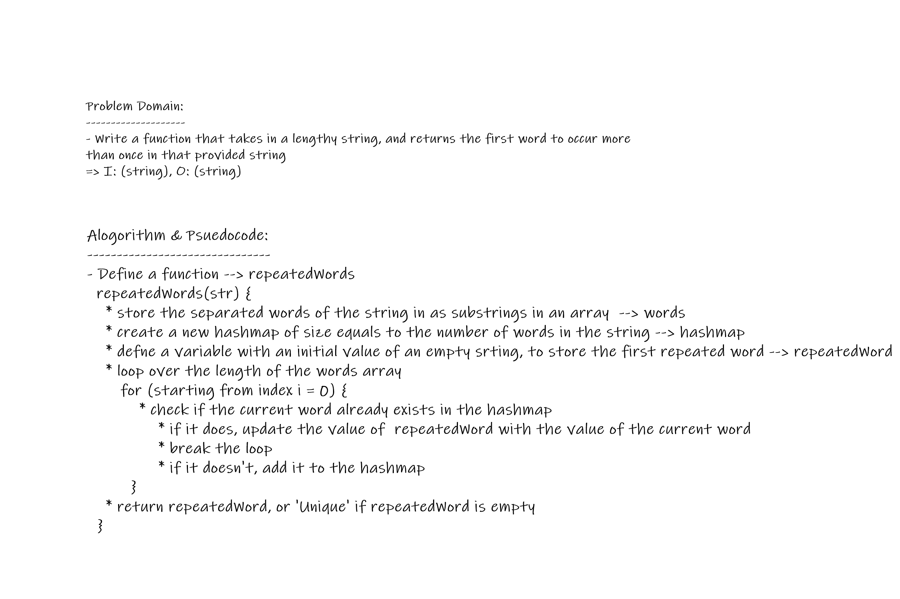
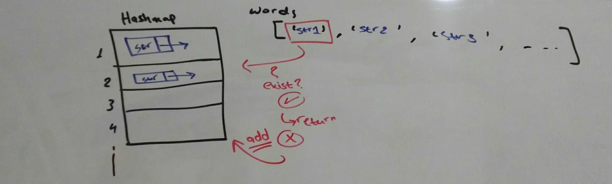

## Challenge Description

**Find the first repeated word in a book**

## Approach & Efficiency

### Approach:   
**Iterative**  
- for loop
- conditional statement

### Big O:

- **Time Complexity**:  

  **O(n*m)**
  - `n`: number of unrepeated words in a string 
  - `m`: number of entries in a hashmap, at a given index

- **Space Complexity**:

  **O(n*m)**
  - `n`: number of words in a string = size of the hashmap => `O(n) + O(n) = 2*O(n)` $\approx$ `O(2)`
  - `m`: number of entries in a hashmap, at a given index

## Solution

