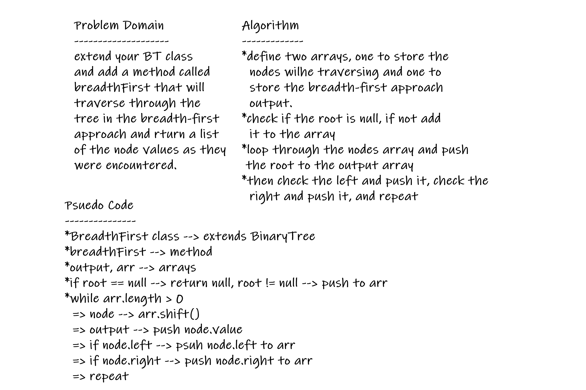
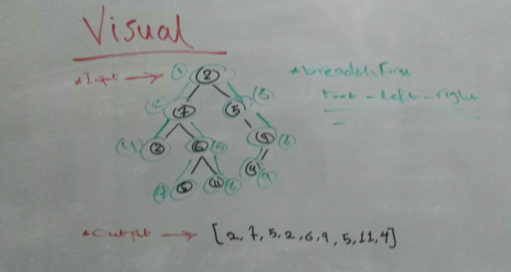

# Binary Tree and BST Implementation

## Challenge Description

Write a breadth first traversal method which takes a Binary Tree as its unique input. Traverse the input tree using a Breadth-first approach, and return a list of the values in the tree in the order they were encountered

## Approach & Efficiency

- The challenge was solved using classes, conditional statements and loops (if & while).

### Big O

- Time Complexity:
  - breadthFirst --> O(n) //dependent on # of nodes

- Space Complexity:
  - breadthFirst --> O(n) //array increases in size with # of nodes

## Whiteboard

