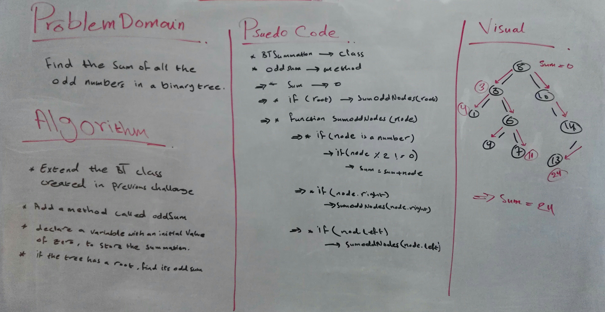

# Binary Tree Odd Sumation

## Challenge Description

Find All The Numbers In a Binary Tree.

## Approach & Efficiency

Used classes, conditional statemetns, and a recurrsive function.

### Big O

- Time Complexity:
  O(n) --> depends on the number of nodes
- Space Complexity:
  O(1) --> constant operation (one variable)

## Whiteboard

